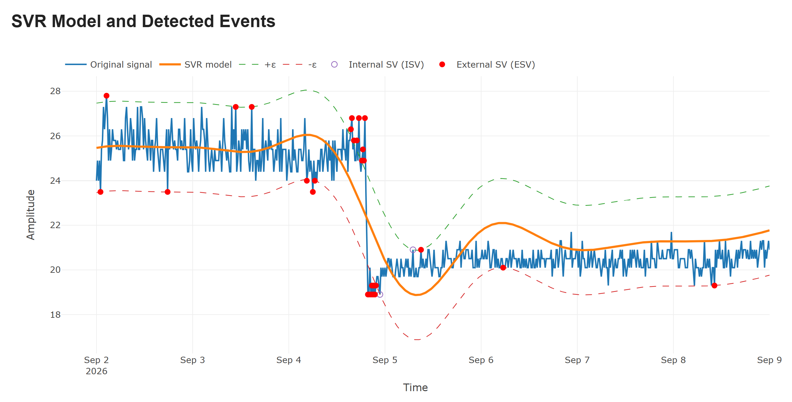

# wavelet-lab

Interactive web app for real-world signal exploration, wavelet analysis, event-based sampling, and SVM-based event detection — powered by Python and Flask.

## Overview

Wavelet Lab is an experimental web application for exploring signal processing techniques using real-world data. It combines data retrieval, interactive visualization, and analytical tools in a shared Signal Processing Lab.

The project currently supports seismic waveforms from EarthScope and hydrological time series from the USGS Water Data API.

## Live Demo

Wavelet Lab is deployed on Render and is available at:

**[https://wavelet-lab.onrender.com](https://wavelet-lab.onrender.com)**

The application is automatically deployed from the `master` branch, so each new release is published to the live environment after it is merged.

## Features

### Data Explorers

- **EarthScope Explorer:** Retrieve seismic waveforms using dynamic network, station, and channel selection.
- **USGS Earthquake Catalog:** Discover recent earthquakes with magnitude filters and configurable result limits.
- **Water Data Explorer:** Explore monitoring stations, retrieve historical streamflow observations, and visualize hydrographs.
- Transfer selected signals from either explorer directly to the Signal Processing Lab.

### Signal Processing Lab

- **Wavelet compression:** Apply discrete wavelet transforms and compare the original and reconstructed signals, including retained coefficients and reconstruction RMSE.
- **CWT analysis:** Explore time-frequency representations using Morlet and Mexican Hat wavelets with configurable parameters.
- **Event-based sampling:** Compare Send-on-Delta, energy-domain sampling, predictive Send-on-Delta, and the integral criterion.
- **Optional wavelet preprocessing:** Investigate the effect of wavelet coefficient thresholding on event-based sampling.
- **SVM event detection:** Fit an RBF Support Vector Regression model and identify observations outside the epsilon-insensitive tube.
- Interactive Plotly visualizations for signals, reconstructions, sampling results, and detected events.

## Screenshots

*SVR model, epsilon-insensitive tube, and detected events highlighted in red.*

## Technologies

- Python
- Flask
- NumPy
- SciPy
- PyWavelets
- scikit-learn
- Plotly
- JavaScript

## Project Status

Wavelet Lab is under active development. The current implementation provides an experimental environment for comparing signal processing and event detection methods.

Planned work includes improved reconstruction-error metrics, comparative evaluation of sampling algorithms, and SVM-based analysis of wavelet scalograms.

## Changelog

See [CHANGELOG.md](CHANGELOG.md) for the release history.